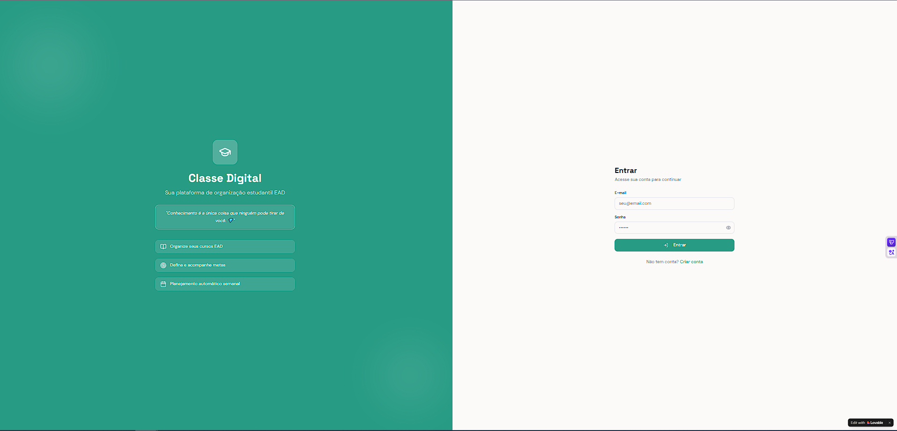
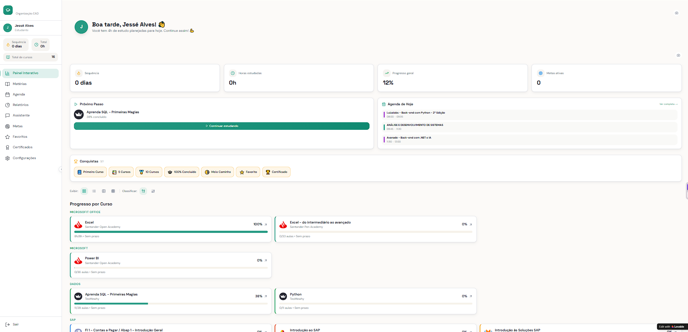
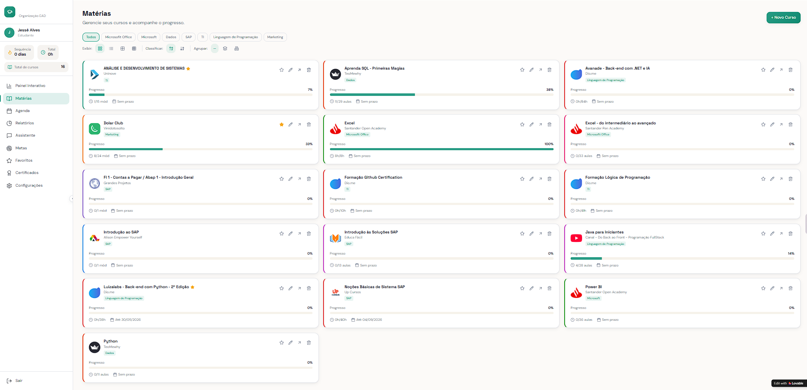
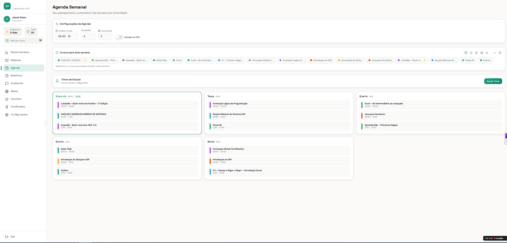
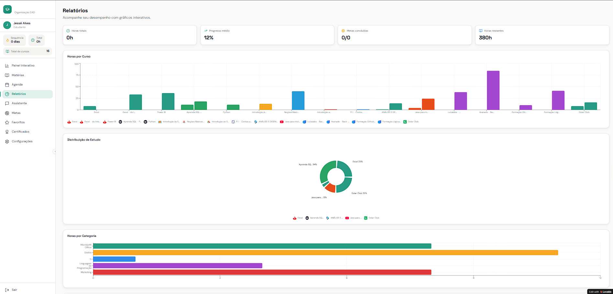
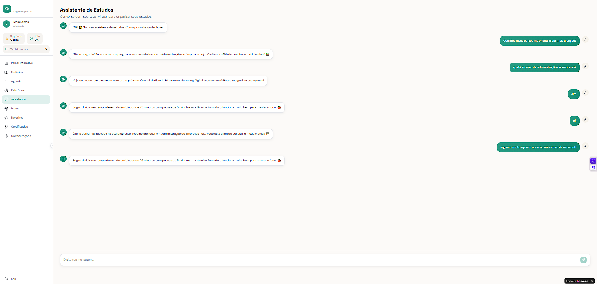
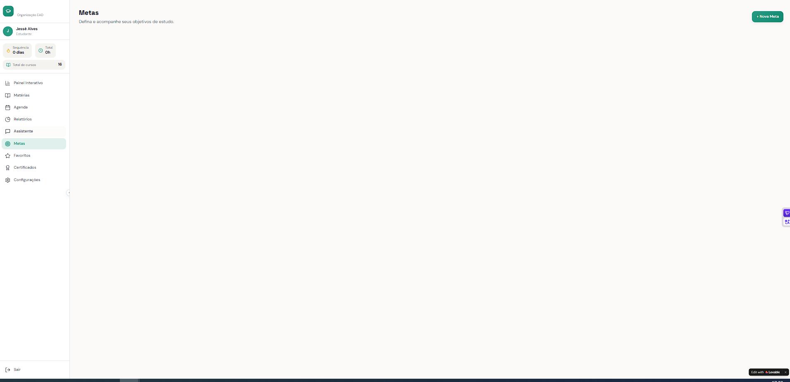
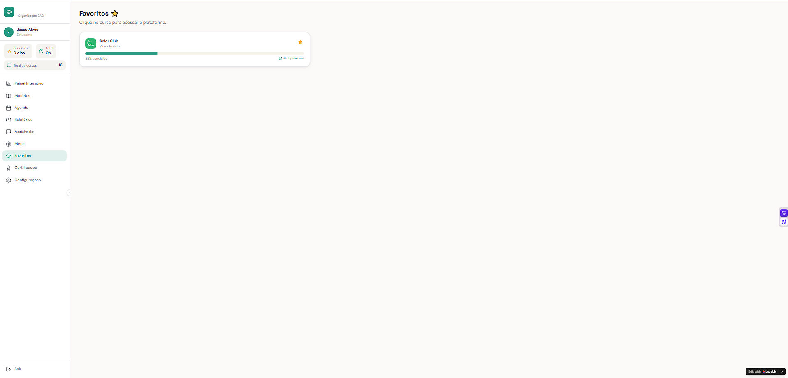
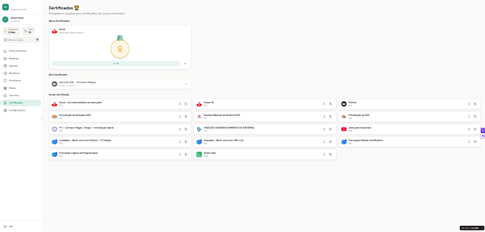

# Classe Digital

Aplicativo conceitual para organização de estudos EAD e trilhas de aprendizagem.  
Ajuda estudantes a organizar cursos online, planejar estudos e acompanhar o progresso.

🔗 **Acesse o app:** [Clique aqui para abrir o Classe Digital](https://classedigital.lovable.app)

---

## Interface do Aplicativo

### Login e Cadastro

### Tela Inicial e Menu

### Cadastro de Cursos

### Agenda de Estudos

### Relatórios

### Metas

### Favoritos

### Certificados

### Configurações

---

## Sobre o Projeto

O Classe Digital é um aplicativo criado para ajudar estudantes a organizarem seus estudos e cursos online, oferecendo **uma visão clara do progresso** e permitindo planejar uma rotina de aprendizado eficiente.

A ideia surgiu da dificuldade de muitos alunos em saber por onde começar quando possuem vários cursos em diferentes plataformas.

---

## Problema

Muitos estudantes acumulam cursos online e acabam se perdendo entre conteúdos, não conseguem organizar uma rotina de estudos e muitas vezes abandonam o aprendizado.

---

## Solução

O Classe Digital organiza a jornada de aprendizado do usuário, permitindo acompanhar cursos, estruturar um planejamento de estudos e acessar diretamente cada curso cadastrado por meio de link.

---

## Funcionalidades

- Cadastro e organização de cursos  
- Planejamento de estudos  
- Acompanhamento de progresso  
- Estruturação de trilhas de aprendizado  
- Acesso direto aos cursos cadastrados através de link  

---

## Roadmap

### Versão 1
- Organização de cursos  
- Planejamento de estudos  
- Controle de progresso  

### Versão 2 (planejada)
- Sugestão automática de trilhas de estudo  
- Estatísticas de aprendizado  
- Organização por prioridades  

### Versão 3 (futuro)
- Integração com plataformas de cursos  
- Recomendações personalizadas de estudo  

---

## Conceito do Aplicativo

O Classe Digital foi pensado como uma ferramenta simples para organização de estudos digitais, concentrando a gestão de cursos em um único lugar.  
O objetivo é reduzir a desorganização causada pelo excesso de plataformas de ensino e ajudar o estudante a manter consistência em sua jornada de aprendizado.

---

## Status do Projeto

Aplicativo finalizado / versão inicial concluída.

---

## Documentação

📄 [Veja o PRD completo do projeto](PRD.md)

## Tecnologias Utilizadas

- **Lovable App Platform** – Plataforma no-code/low-code para criação do app  
- **Web / Mobile** – Aplicativo compatível com navegador e dispositivos móveis  
> Obs: O backend e lógica do app são gerados automaticamente pela plataforma, sem necessidade de programação manual em Java ou outra linguagem.

---

## Como Testar

1. Acesse o link do app  
2. Cadastre um curso ou importe seus próprios links  
3. Experimente a agenda, metas e relatórios

---

## Autor

**Jessé Alves de Oliveira**
